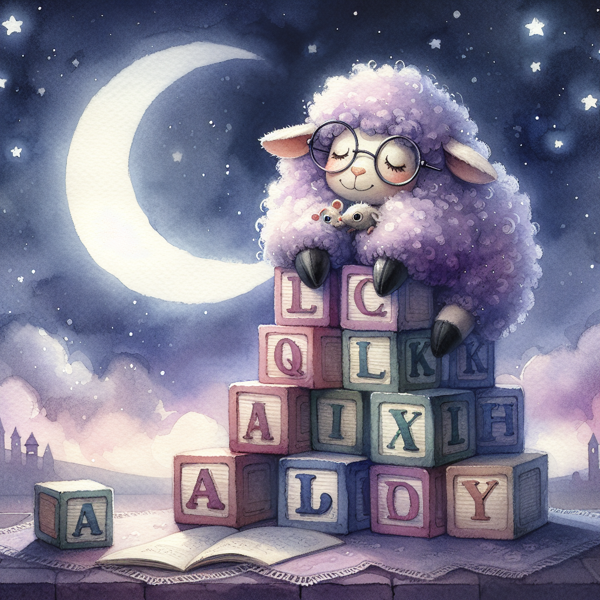

# MagicStory - AI-Powered Children's Story Creator

MagicStory is an interactive platform that allows users to create and experience personalized children's stories using artificial intelligence. The application enables parents, teachers, and storytellers to quickly generate immersive stories with custom characters, professional narration, and beautiful illustrations.



## 🌟 Features

- **AI-Powered Story Generation**: Create complete children's stories with just a few clicks
- **Customizable Characters**: Design unique characters with distinct traits and personalities
- **Theme Selection**: Choose from various themes to set the tone of your story
- **Age-Appropriate Content**: Target specific age groups with appropriate language and themes
- **Interactive Story Viewer**: Read and experience stories with beautiful illustrations
- **User Authentication**: Secure account management with email and Google sign-in options
- **Subscription Tiers**: Access different features based on subscription levels

## 🚀 Getting Started

### Prerequisites

- Node.js (v16 or later)
- npm or yarn
- Supabase account for backend services

### Installation

1. Clone the repository:

   ```bash
   git clone https://github.com/yourusername/magic-story.git
   cd magic-story
   ```

2. Install dependencies:

   ```bash
   npm install
   ```

3. Configure environment variables:

   - Rename `.env.example` to `.env.local`
   - Update the Supabase URL and anon key
   - Add any other required API keys

4. Run the development server:

   ```bash
   npm run dev
   ```

5. Open [http://localhost:3000](http://localhost:3000) in your browser to see the application.

## 📂 Project Structure

- **`/app`**: Next.js App Router pages and API routes

  - **`/story`**: Story viewing and creation routes
  - **`/profile`**: User profile management
  - **`/checkout`**: Subscription management
  - **`/api`**: Backend API endpoints
  - **`actions.ts`**: Server actions for data operations

- **`/components`**: Reusable UI components

  - **`/ui`**: Basic UI components from shadcn/ui
  - **`/organisms`**: Complex component compositions
    - **`/hero`**: Landing page hero section
    - **`/story-viewer`**: Components for viewing stories

- **`/lib`**: Core libraries and type definitions

  - **`/types`**: TypeScript interfaces and types
    - **`/story`**: Story-related type definitions

- **`/utils`**: Utility functions and helpers
  - **`/supabase`**: Supabase client configuration
  - **`/story-options`**: Story generation options

## 🧠 Key Concepts

### Story Creation Flow

1. **Character Selection**: Choose or create a character for your story
2. **Theme Selection**: Pick a theme that sets the emotional tone
3. **Setting Selection**: Choose where your story takes place
4. **Age Target**: Select the appropriate age group
5. **Story Generation**: AI creates a complete story with text and image prompts
6. **Story Viewer**: Read and interact with the generated story

### Authentication

The application uses Supabase for authentication, supporting:

- Email/password registration and login
- Google OAuth integration
- Password reset functionality

### Subscription Tiers

Users can access different features based on their subscription level:

- Free tier with limited story generation
- Premium tiers with additional features and higher usage limits

## 🛠️ Technologies

- **Frontend**: Next.js, React, TailwindCSS, shadcn/ui
- **3D Visualization**: Three.js, React Three Fiber
- **Authentication**: Supabase Auth
- **Database**: Supabase PostgreSQL
- **AI Integration**: OpenAI, Replicate
- **Styling**: TailwindCSS, Framer Motion

## 📱 Usage

1. Create an account or log in
2. Navigate to the "Create" page
3. Follow the guided process to select character, theme, setting and age group
4. Wait for AI to generate your story
5. View, share or save your story
6. Access your stories anytime from your profile

## 🤝 Contributing

Contributions are welcome! Please feel free to submit a Pull Request.

## 📄 License

This project is licensed under the MIT License - see the LICENSE file for details.

## ✨ Acknowledgements

- Built with [Next.js](https://nextjs.org/)
- Authentication and database by [Supabase](https://supabase.com/)
- UI components from [shadcn/ui](https://ui.shadcn.com/)
- 3D effects with [React Three Fiber](https://docs.pmnd.rs/react-three-fiber)
